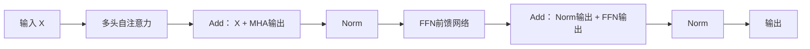

### **Encoder-Decoder Architecture with Attention Network**
**解释**：  
传统的编码器-解码器架构（如RNN）将输入序列压缩为固定长度的上下文向量，导致长序列信息丢失。引入注意力机制后，解码器每一步动态关注编码器的不同部分，提升长序列处理能力。

**核心组件**：
1. **Encoder**  
   - **作用**：将输入序列（如句子）编码为隐藏状态序列 `h = (h₁, h₂, ..., hₙ)`。  
   - **公式**（RNN为例）：  
     $$ h_t = \text{RNN}(x_t, h_{t-1}) $$

2. **Decoder**  
   - **作用**：基于编码器输出和上一步生成结果，逐步生成目标序列。  
   - **公式**（带注意力）：  
     $$ s_j = \text{RNN}(y_{j-1}, s_{j-1}, c_j) $$  
     其中 `c_j` 是当前步的上下文向量（由注意力生成）。

3. **Attention Layer**  
   - **作用**：计算解码器当前状态 `s_j` 与编码器所有状态 `h_i` 的相关性权重。  
   - **输出**：上下文向量 `c_j`（加权平均编码器隐藏状态）。

4. **Hidden State**  
   - **作用**：RNN中存储历史信息的向量（`h_i` 为编码器隐藏状态，`s_j` 为解码器隐藏状态）。

5. **Alignment Score**  
   - **作用**：衡量 `s_j` 与 `h_i` 的相关性。  
   - **公式**（加性注意力）：  
     $$ e_{ij} = v^T \tanh(W_a [s_j; h_i]) $$  
     - `v`, `W_a` 为可学习参数，`[;]` 表示拼接。

---

### **The Transformer Architecture**
**核心创新**：  
完全基于自注意力（Self-Attention），摒弃RNN，支持并行计算，解决长距离依赖问题。

#### **输入处理**
1. **Inputs**  
   - 词序列（如 `[I, love, NLP]`）。

2. **Input Embedding**  
   - **作用**：将词索引映射为稠密向量 `X ∈ ℝ^{n×d_{model}}`（`n`=序列长，`d_{model}`=向量维度）。  
   - **公式**：  
     $$ X = \text{EmbeddingLookup}(\text{input_ids}) $$

3. **Positional Encoding**  
   - **作用**：为输入添加位置信息（因Transformer无时序结构）。  
   - **公式**：  
     $$ \text{PE}(pos,2i) = \sin(pos / 10000^{2i/d_{model}}) $$  
     $$ \text{PE}(pos,2i+1) = \cos(pos / 10000^{2i/d_{model}}) $$  
     最终输入： `X = X + PE`

#### **Encoder/Decoder层结构**
4. **Multi-Head Attention**  
   - **作用**：并行执行多个自注意力头，捕获不同子空间特征。  
   - **公式**：  
     $$ \text{MultiHead}(Q,K,V) = \text{Concat}(\text{head}_1, ..., \text{head}_h)W^O $$  
     其中每个头： $\text{head}_i = \text{Attention}(QW_i^Q, KW_i^K, VW_i^V)$。

5. **Add & Norm**  
   - **作用**：残差连接防止梯度消失，层归一化稳定训练。  
   - **公式**：  
     $$ \text{LayerNorm}(X + \text{Sublayer}(X)) $$  
     （`Sublayer` 可以是多头注意力或前馈网络）。

### 多头注意力（Multi-Head Attention）后的输出处理  
在Transformer中，**多头注意力层**的输出会经过以下处理流程：

1. **多头注意力输出**：  
   $$ \text{MultiHead}(Q,K,V) = \text{Concat}(\text{head}_1, ..., \text{head}_h)W^O $$
   - 其中每个头： $\text{head}_i = \text{Attention}(QW_i^Q, KW_i^K, VW_i^V)$

2. **残差连接（Add）**：  
   $$ X_{\text{attn}} = X_{\text{in}} + \text{MultiHead}(Q,K,V) $$
   - 输入 $X_{\text{in}}$ 直接与多头注意力输出相加  
   - **作用**：缓解梯度消失，保留原始信息

3. **层归一化（Norm）**：  
   $$ X_{\text{out}}^{\text{(MHA)}} = \text{LayerNorm}(X_{\text{attn}}) $$
   - 公式：  
   $$ \text{LayerNorm}(x) = \gamma \frac{x - \mu}{\sqrt{\sigma^2 + \epsilon}} + \beta $$
   - $\gamma,\beta$：可学习参数；$\mu,\sigma$：特征的均值和方差

---

### 前馈网络（Feed Forward Network）后的输出处理  
**前馈网络（FFN）** 的输出处理流程：

1. **前馈网络计算**：  
   $$ \text{FFN}(x) = \text{ReLU}(xW_1 + b_1)W_2 + b_2 $$
   - 典型维度：$W_1: d_{model} \times d_{ff}$（$d_{ff}=4d_{model}$），$W_2: d_{ff} \times d_{model}$

2. **残差连接（Add）**：  
   $$ X_{\text{ffn}} = X_{\text{in}}^{\text{(FFN)}} + \text{FFN}(X_{\text{in}}^{\text{(FFN)}}) $$
   - 注意：此处的 $X_{\text{in}}^{\text{(FFN)}}$ 是前一步层归一化的输出

3. **层归一化（Norm）**：  
   $$ X_{\text{out}}^{\text{(FFN)}} = \text{LayerNorm}(X_{\text{ffn}}) $$

---

### 完整层处理流程（以Transformer编码器层为例）

#### 数学公式流程：
1. 多头注意力层：  
   $$ Z = \text{LayerNorm}\big( X + \text{MultiHead}(X,X,X) \big) $$

2. 前馈网络层：  
   $$ \text{Output} = \text{LayerNorm}\big( Z + \text{FFN}(Z) \big) $$

---

### 关键设计解析
| 组件          | 作用                                                                 | 实现效果                                                                 |
|---------------|----------------------------------------------------------------------|--------------------------------------------------------------------------|
| **残差连接**  | $X_{\text{in}} + \text{Sublayer}(X_{\text{in}})$                     | 确保梯度直通，缓解深层网络退化问题                                       |
| **层归一化**  | 标准化每层的激活值                                                   | 稳定训练过程，加速收敛                                                   |
| **子层顺序**  | 注意力 → Add/Norm → FFN → Add/Norm                                   | 先捕获全局依赖，再非线性变换增强表示能力                                 |
| **维度一致**  | 所有子层输入/输出维度 = $d_{model}$                                 | 支持任意堆叠层数（原始论文：编码器6层/解码器6层）                        |

> **为什么两次Add & Norm？**  
> 1. **注意力后归一化**：聚焦全局依赖关系  
> 2. **FFN后归一化**：增强非线性表示能力  
> 双重残差设计使Transformer可堆叠至数十层（如BERT-base:12层，GPT-3:96层）而不退化。

6. **Output Embedding**  
   - 解码器输入嵌入（与Input Embedding类似，但独立训练或共享权重）。

---

### **Self-Attention 机制**
**作用**：计算序列内每个词与其他词的相关性权重，生成上下文感知的表示。

#### **计算步骤**
1. **Query, Key, Value**  
   - **来源**：输入矩阵 `X` 的线性变换。  
   - **公式**：  
     $$ Q = XW^Q, \quad K = XW^K, \quad V = XW^V $$  
     （`W^Q`, `W^K`, `W^V` 为可学习权重）。

2. **Scores**  
   - **作用**：通过点积计算 `Q` 和 `K` 的相似度。  
   - **公式**：  
     $$ \text{Scores} = QK^T $$

3. **Divided by 8**  
   - **作用**：缩放点积结果，防止梯度消失（`d_k`=Key的维度，通常为64）。  
   - **公式**：  
     $$ \text{Scaled Scores} = \frac{QK^T}{\sqrt{d_k}} \quad (\sqrt{d_k} \approx 8) $$

4. **Softmax**  
   - **作用**：将分数归一化为概率分布（权重）。  
   - **公式**：  
     $$ \text{Attention Weights} = \text{Softmax}\left(\frac{QK^T}{\sqrt{d_k}}\right) $$

5. **Softmax * Value**  
   - **作用**：用权重对 `Value` 加权，生成注意力输出。  
   - **公式**：  
     $$ Z = \text{Softmax}\left(\frac{QK^T}{\sqrt{d_k}}\right) V $$

6. **Sum**  
   - **隐含步骤**：上一步的矩阵乘法已实现加权求和（`Z` 的每一行是 `V` 的加权和）。

---

### **关键对比**
| **组件**               | **传统 Encoder-Decoder**        | **Transformer**               |
|------------------------|--------------------------------|-------------------------------|
| **核心结构**          | 基于RNN                        | 基于自注意力（无RNN）         |
| **并行性**            | 顺序计算（无法并行）           | 完全并行                      |
| **长距离依赖**        | 弱（依赖隐藏状态传递）         | 强（直接计算任意词间关系）    |
| **注意力类型**        | 编码器-解码器注意力            | 自注意力 + 编码器-解码器注意力 |
| **位置处理**          | 隐式（RNN时序）                | 显式（位置编码）              |
| **层归一化**          | 无                             | Add & Norm（稳定训练）        |

**Transformer优势**：  
- 并行计算显著加速训练。
- 自注意力直接建模任意距离依赖，提升长序列性能（如机器翻译、文本生成）。
- 多头注意力捕获多种语义关系（如语法、指代）。