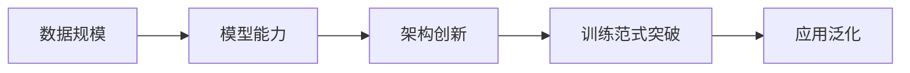

以下是对 NLP 语言模型发展历程的系统性总结与对比分析，结合关键术语解释和核心技术演进：

---

### **一、NLP 语言模型技术发展一览**
| **阶段**       | **时间范围**      | **代表技术/模型**              | **数据规模**       | **核心创新**                     | **局限性**                     |
|----------------|------------------|-------------------------------|-------------------|--------------------------------|-------------------------------|
| **人工规则**   | 1950s-1990s      | 基于专家知识的规则系统          | 少量规则集         | 可解释性强                      | 泛化能力差，无法处理复杂语言    |
| **统计学习**   | 1990s-2012       | HMM, CRF, SVM                 | 百万级标注数据      | 概率建模，解决部分歧义          | 依赖特征工程，长距离依赖弱      |
| **深度学习**   | 2013-2018        | Word2Vec, Seq2Seq, Attention  | 十亿级数据         | 端到端表示学习                  | 仍需大量标注数据                |
| **预训练时代** | 2018-2020        | Transformer, BERT, GPT-1/2    | 千亿级未标注数据    | Pre-training + Fine-tuning 范式 | 任务适配需微调                  |
| **大模型时代** | 2020-至今        | GPT-3/4, ChatGPT              | 万亿级多模态数据    | In-context Learning, RLHF       | 计算成本高，黑盒风险            |

> **关键术语**  
> - **HMM (隐马尔可夫模型)**：基于状态转移的概率模型，用于序列标注（如词性标注）  
> - **CRF (条件随机场)**：判别式图模型，解决标签依赖问题（优于 HMM）  
> - **Word2Vec**：通过上下文预测词向量，首次实现分布式语义表示  

---

### **二、预训练语言模型三大架构对比 (2018-2020)**
| **架构类型**     | **代表模型** | **核心特点**                  | **训练目标**           | **典型任务**              |
|------------------|-------------|-----------------------------|----------------------|--------------------------|
| **Encoder**      | BERT        | 双向上下文编码                | Masked LM + NSP      | 文本分类、NER、QA         |
| **Decoder**      | GPT-1/2     | 单向自回归生成                | 标准语言建模          | 文本生成、续写            |
| **Encoder-Decoder** | T5, BART    | 联合编码-解码                 | 去噪重建 (Denoising) | 摘要、翻译、改写          |

**核心创新**：  
- **BERT**：首次实现深度双向预训练，刷新 11 项 NLP 任务记录  
- **GPT 系列**：证明纯解码器架构的生成能力  
- **T5**：将所有 NLP 任务统一为 text-to-text 格式  

---

### **三、GPT-1 → GPT-3 演进**
| **模型** | **参数量** | **技术突破**                | **关键能力**                          |
|----------|-----------|---------------------------|--------------------------------------|
| GPT-1    | 117M      | 首个 Transformer Decoder 预训练模型 | 生成连贯文本                          |
| GPT-2    | 1.5B      | Zero-shot 任务泛化          | 无需微调完成阅读理解、翻译等任务        |
| **GPT-3** | 175B      | In-context Learning        | 仅通过提示（Prompt）适应新任务          |

> **In-context Learning (上下文学习)**  
> 模型根据提示中的示例直接推理，无需更新参数（如输入："苹果→Apple；香蕉→Banana；西瓜→?"）  
> **本质**：通过大规模训练隐式学习任务泛化规则  

---

### **四、大模型时代三大核心概念**
| **概念**               | **定义**                                                                 | **示例**                                  |
|------------------------|--------------------------------------------------------------------------|------------------------------------------|
| **Few-Shot Learning**  | 模型通过少量示例（通常 1-10 个）快速适应新任务                               | 给出 3 条情感分析样本，预测新句子情感       |
| **Prompt Engineering** | 设计最佳提示模板以激发模型能力（如指令、示例、格式）                          | "请将以下英文翻译为中文：{text}"           |
| **RLHF (人类反馈强化学习)** | 基于人类偏好优化模型输出（ChatGPT 核心技术）                               | 人工标注回答质量，训练奖励模型引导生成      |

---

### **五、Pre-training + Fine-tuning 范式 vs. GPT 范式**
| **范式**              | **训练流程**                            | **优势**                | **劣势**                |
|-----------------------|---------------------------------------|------------------------|------------------------|
| **Pre-train + Fine-tune** | 预训练 → 任务微调                      | 任务性能上限高          | 每个任务需单独微调       |
| **GPT 范式 (In-context)** | 预训练 → Prompt 直接推理               | 零样本泛化，无需训练     | 依赖提示设计，稳定性低    |
| **ChatGPT 范式**      | 预训练 → SFT → RM → PPO               | 对齐人类价值观，安全性高 | 训练复杂，成本极高       |

> **SFT (监督微调)**：用人类标注的高质量数据微调模型  
> **PPO (近端策略优化)**：强化学习算法，根据奖励模型更新策略  

---

### **六、GPT-3.5 → GPT-4 质变突破**
| **模型**   | **核心技术**                     | **能力跃迁**                          |
|------------|----------------------------------|--------------------------------------|
| **GPT-3.5** | 代码训练 (Codex)                 | 逻辑推理能力提升 40%，支持代码生成与调试 |
| **ChatGPT** | 三阶段训练 (SFT + RM + PPO)      | 生成符合人类偏好的对话，拒绝有害请求     |
| **GPT-4**   | 多模态 + 128K 上下文 + 插件生态   | 图文理解、长文档处理、工具调用（计算器/浏览器）|

**关键创新**：  
- **多模态**：支持图像/文本混合输入（如解析图表内容）  
- **扩展上下文**：处理 300 页文档（128K tokens）  
- **生态整合**：插件系统连接现实工具（如 Wolfram Alpha 数学计算）  

---

### **七、核心术语速查表**
| **术语**          | **解释**                                                                 |
|-------------------|--------------------------------------------------------------------------|
| **Transformer**   | 基于自注意力的架构，替代 RNN/CNN，支持并行计算                           |
| **Masked LM**     | BERT 训练目标：随机遮盖单词并预测，学习双向上下文                         |
| **RLHF**          | 人类反馈强化学习：将人类偏好转化为奖励信号优化模型                        |
| **MoE (混合专家)** | 稀疏激活架构（如 GPT-4），仅调用部分参数，降低万亿模型计算成本            |
| **Positional Encoding** | 位置编码：为 Transformer 添加序列顺序信息（正弦函数/可学习向量）          |

---

### **总结：大模型发展核心逻辑**

- **数据驱动**：未标注数据利用效率提升 1000 倍（Word2Vec→GPT-4）  
- **架构进化**：Encoder/Decoder → 纯 Decoder → MoE 稀疏化  
- **范式革命**：Fine-tuning → In-context Learning → RLHF 对齐  
- **未来方向**：多模态具身智能、低功耗边缘计算、可信 AI 机制