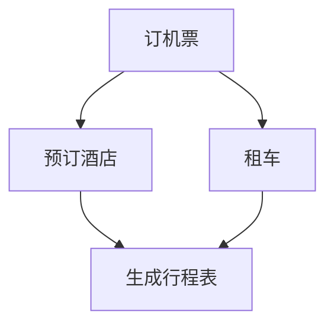
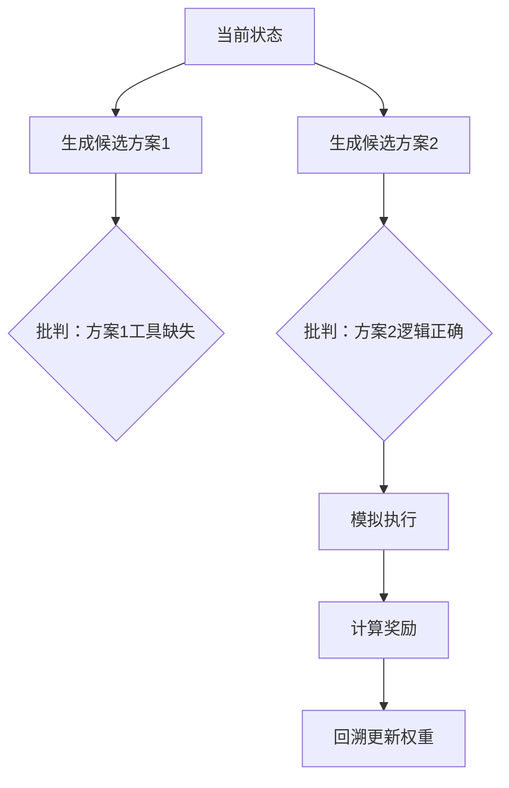
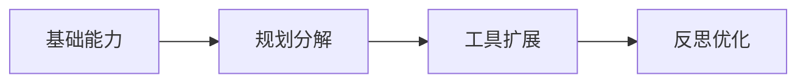

以下是针对 AI Agent 技术体系的系统性归纳与核心术语解析，结合 ReAct、RAG、DAG、CoT 及 LATS 等关键技术的深度解释：

---

### **一、AI Agent 本质定义**
**AI Agent（人工智能代理）**  
> 具备**感知环境（Sensors）→ 推理决策（Reasoning Engine）→ 执行动作（Actuators）**能力的自主系统，通过工具使用和长期规划实现复杂目标。  
**核心特征**：  
- **自治性**（Autonomy）：无需人类实时干预  
- **反应性**（Reactivity）：动态响应环境变化  
- **目标导向**（Goal-driven）：执行多步规划  
- **学习能力**（Learning）：从反馈中优化策略  

---

### **二、ReAct：Agent 早期范式**  
#### **关键组件与技术**  
| **组件**              | **作用**                                                                 | **技术关联**                          |
|-----------------------|--------------------------------------------------------------------------|---------------------------------------|
| **LLM**               | 核心推理引擎，生成决策与工具调用指令                                      | 提供零样本推理能力                    |
| **Tools**             | 外部能力扩展（搜索/计算/API 调用）                                        | 如 `Python REPL`, `Web Search`        |
| **Chain-of-Thought (CoT)** | 分步推理提示技术（"Let's think step by step"）                             | 解决复杂问题，提升逻辑性              |
| **ReAct Prompting**   | **Re**asoning + **Act**ion 融合框架，交替执行思考与动作                    | 格式：`Thought: ... Action: ...`      |

**工作流程**：  
```plaintext
1. Thought: 分析当前问题（CoT）  
2. Action: 调用工具（如 Search[气候变化影响]）  
3. Observation: 获取工具返回结果  
4. 循环直至生成最终答案  
```

---

### **三、AI Agent 核心组件**  
#### 1. **感知层（Sensors）**  
   - 输入：文本/图像/传感器数据 → 转化为 **Precepts**（环境抽象表示）  
#### 2. **推理引擎（Reasoning Engine）**  
   - 基于 LLM 生成 **Rational Solutions**（规划序列或工具调用链）  
#### 3. **执行层（Actuators）**  
   - 输出：执行动作（如 API 调用、机器人控制）  

> **示例**：自动驾驶 Agent  
> - **Sensors**：摄像头 → 感知道路图像  
> - **Reasoning**：LLM 规划路径（"前方障碍物，右转避让"）  
> - **Actuators**：控制方向盘右转  

---

### **四、Agent 类型与技术栈**  
#### 1. **按场景分类**  
| **类型**         | **典型架构**     | **案例**                      |
|------------------|-----------------|------------------------------|
| **行动代理**     | ReAct + Tools   | NL2SQL（自然语言转数据库查询） |
| **模拟代理**     | 多代理协作       | 斯坦福「虚拟小镇」25个Agent社交 |
| **自主代理**     | 分层规划 + 记忆  | AutoGPT（长期目标分解）        |

#### 2. **按技术实现分类**  
| **类型**               | **关键技术**          | **特点**                              |
|------------------------|----------------------|---------------------------------------|
| **RAG 代理**           | 检索增强生成          | 动态融合外部知识（见下方详解）         |
| **规划代理 (Planning)** | DAG 任务调度          | 多步骤任务并行/串行编排                |
| **反思代理 (Reflection)** | LATS 树搜索          | 通过自我批判优化决策（见下方详解）     |
| **多代理系统**         | Agent 通信协议        | 协作（谈判）/监督（层级分工）          |

---

### **五、核心能力详解**  
#### 1. **Planning（规划）**  
   - **提示工程**：通过 `[角色设定] + [上下文] + [目标描述]` 激活 LLM 规划能力  
   - **策略**：  
     - **任务分解**：将"写论文"拆解为"查资料→列大纲→写作→润色"  
     - **DAG（有向无环图）调度**：  
        ```mermaid
        graph LR
        A[检索资料] --> B[撰写引言]
        A --> C[设计实验]
        B --> D[整合章节]
        C --> D
        D --> E[格式校对]
        ```

#### 2. **Memory（记忆）**  
   - **短期记忆**：对话上下文（Token 窗口）  
   - **长期记忆**：向量数据库存储历史经验  

#### 3. **Tools（工具）**  
   - **扩展能力**：  
     ```python
     tools = [
         Tool(name="Calculator", func=math_calculator),
         Tool(name="WebSearch", func=google_search)
     ]
     ```

---

### **六、关键技术深度解析**  
#### 1. **RAG（检索增强生成）变体**  
| **类型**          | **核心机制**                                                                 | **适用场景**                     |
|-------------------|-----------------------------------------------------------------------------|----------------------------------|
| **Adaptive RAG**  | 动态调整检索策略（如关键词/语义检索切换）                                     | 模糊查询（“最新AI进展”）          |
| **Agentic RAG**   | Agent 自主重组查询（如将“气候影响”拆解为“温度+海平面+生态”）                  | 复杂问题多轮检索                 |
| **Corrective RAG**| 自我批判修正结果（生成 → 检索验证 → 修正）                                    | 高精度需求（医疗/法律）           |
| **Self-RAG**      | 记忆历史检索结果加速响应                                                    | 多轮对话（客服连续提问）          |

#### 2. **DAG（有向无环图）**  
> 用于描述任务依赖关系的无循环图，**确保规划可执行**  
**示例 - 旅行规划 Agent**：  


#### 3. **Chain-of-Thought (CoT)**  
> **分步推理提示技术**，引导 LLM 显式展示逻辑链  
**效果**：数学题准确率提升 40%+  
**提示模板**：  
```
问题：小明有 5 个苹果，吃掉 2 个后买了 3 个，现在有几个？  
思考：首先剩余苹果 = 5 - 2 = 3，然后新增 3 个 → 总计 3 + 3 = 6  
答案：6
```

#### 4. **Language Agent Tree Search (LATS)**  
> 融合 **蒙特卡洛树搜索（MCTS）** 的 Agent 决策框架  
**四步循环**：  
1. **Thought Generation**：LLM 生成候选决策  
2. **Self-Critique**：批判候选方案的漏洞（如工具调用错误）  
3. **Environment Simulation**：模拟执行结果  
4. **Reward Backpropagation**：根据结果奖励优化路径  

**流程图示**：  


---

### **总结：Agent 技术演进逻辑**  

- **基础层**：CoT 提供分步推理能力  
- **进化层**：ReAct 实现推理-行动闭环  
- **强化层**：LATS 通过搜索与奖励驱动决策优化  
- **扩展层**：RAG 解决知识实时性，DAG 保障复杂任务可靠性  

> 当前最先进 Agent（如 GPT-4o + AutoGen）已整合全部能力，迈向**自我迭代的自主智能体**。